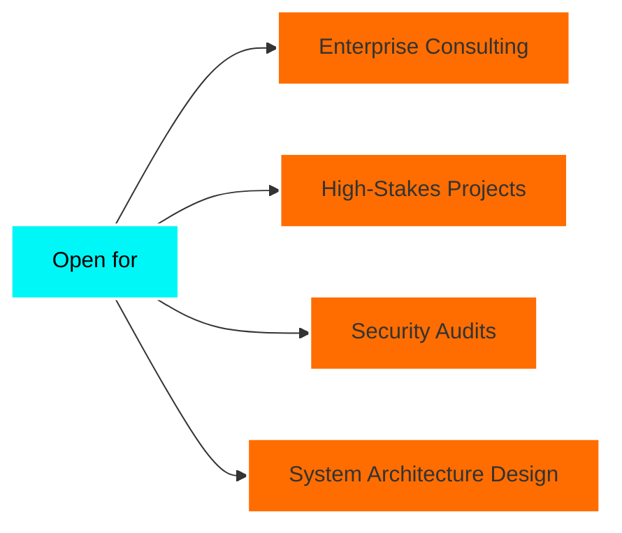

```markdown
# 👋 Hi, I'm Fahad Yousaf

<div align="center">
  
[](https://git.io/typing-svg)

</div>

<div align="center">
  

[](https://github.com/Fahad-Yousaf)
[](https://linkedin.com/in/yourname)

</div>

---

## 🎯 Elite Developer | Security Architect | System Designer

```typescript
const fahad = {
    location: "🌍 Available Worldwide",
    experience: "10+ years in production environments",
    expertise: ["Full-Stack Architecture", "Cybersecurity", "DevSecOps"],
    currentFocus: "Building ultra-secure, scalable enterprise systems",
    available: "Open for high-impact projects & consulting"
};
```


### 🔥 What I Bring to the Table

- ⚡ **10+ years** of battle-tested development experience
- 🛡️ **Cybersecurity expert** – penetration testing, secure code audits
- 🏗️ **System architect** – designed & scaled apps serving 100K+ users
- 🚀 **Performance optimizer** – reduced load times by up to 80%
- 🔐 **Zero-trust security** implementations in production
- 📊 Led teams on **enterprise-grade** SaaS platforms
- 🌐 Expert in **cloud infrastructure** (AWS, Azure, GCP)

<br clear="right"/>

---

## 💼 Professional Expertise

<table>
<tr>
<td width="50%" valign="top">

### 🎨 Frontend Mastery
```javascript
const frontend = {
  frameworks: ['React.js', 'Next.js 14', 'Vue.js'],
  styling: ['Tailwind CSS', 'SASS', 'Styled Components'],
  stateManagement: ['Redux Toolkit', 'Zustand', 'Recoil'],
  animation: ['Framer Motion', 'GSAP', 'Three.js'],
  testing: ['Jest', 'React Testing Library', 'Cypress'],
  performance: ['Lighthouse 95+', 'Core Web Vitals']
};
```

</td>
<td width="50%" valign="top">

### ⚙️ Backend Architecture
```python
backend = {
    "languages": ["Node.js", "Python", "Go"],
    "frameworks": ["Express", "NestJS", "FastAPI"],
    "api_design": ["REST", "GraphQL", "gRPC"],
    "microservices": ["Docker", "Kubernetes"],
    "message_queues": ["RabbitMQ", "Redis", "Kafka"],
    "real_time": ["Socket.io", "WebRTC"]
}
```

</td>
</tr>
</table>

---

## 🛡️ Cybersecurity Arsenal

<div align="center">

| Category | Technologies |
|----------|-------------|
| **Security Testing** | `OWASP Top 10` `Burp Suite` `Metasploit` `Nmap` `Wireshark` |
| **Encryption** | `AES-256` `RSA` `SSL/TLS` `Hashing (bcrypt, Argon2)` |
| **Authentication** | `OAuth 2.0` `JWT` `SAML` `MFA` `Biometric Auth` |
| **DevSecOps** | `Snyk` `SonarQube` `HashiCorp Vault` `Security Headers` |
| **Compliance** | `GDPR` `HIPAA` `SOC 2` `PCI-DSS` |

</div>

---

## 🗄️ Database & Cloud Expertise

<div align="center">

### Databases


### Cloud & DevOps


</div>

---

## 📊 GitHub Performance Analytics

<div align="center">
  
  
</div>

<div align="center">
  
</div>

<div align="center">
  
</div>

---

## 🚀 Featured Enterprise Projects

<div align="center">

### 🏆 Production Systems I've Built

</div>

<table>
<tr>
<td width="50%">

### 🔐 SecureAuth Platform
**Enterprise SSO & Identity Management**

- 🎯 Handles **500K+ monthly active users**
- 🛡️ Zero-trust security architecture
- ⚡ 99.99% uptime SLA
- 🔒 GDPR & SOC 2 compliant

**Tech:** `Next.js` `NestJS` `PostgreSQL` `Redis` `AWS`

[View Architecture →](#)

</td>
<td width="50%">

### 📊 FinTech Analytics Dashboard
**Real-time Financial Intelligence**

- 💰 Processes **$100M+ transactions/month**
- 📈 Real-time data streaming
- 🔍 AI-powered fraud detection
- 🚀 Sub-100ms query response

**Tech:** `React` `Node.js` `MongoDB` `Kafka` `TensorFlow`

[Case Study →](#)

</td>
</tr>

<tr>
<td width="50%">

### 🏥 HealthCare SaaS
**HIPAA-Compliant Patient Portal**

- 🏥 Serves **50+ healthcare providers**
- 🔐 End-to-end encryption
- 📱 Native mobile apps (React Native)
- 🤖 AI appointment scheduling

**Tech:** `Next.js` `Express` `PostgreSQL` `Docker` `Azure`

[Live Demo →](#)

</td>
<td width="50%">

### 🛒 E-Commerce Microservices
**Scalable Multi-Vendor Marketplace**

- 🌐 **10K+ concurrent users**
- 🔄 Event-driven architecture
- 💳 Payment gateway integration
- 📦 Real-time inventory management

**Tech:** `React` `NestJS` `Microservices` `Redis` `K8s`

[GitHub →](#)

</td>
</tr>
</table>

---

## 🎓 Certifications & Credentials

<div align="center">

| Security | Cloud | Development |
|:--------:|:-----:|:-----------:|
|  |  |  |
|  |  |  |
|  |  |  |

</div>

---

## 💡 Current Focus & Availability

<div align="center">



</div>

### 🎯 Specialized Services
- 🔒 **Security Audits & Penetration Testing**
- 🏗️ **System Architecture & Design Consultation**
- ⚡ **Performance Optimization & Scaling**
- 🚀 **CI/CD Pipeline Implementation**
- 📚 **Technical Leadership & Mentoring**

---

## 📈 Contribution Graph

<div align="center">
  


</div>

---

## 🌐 Let's Connect & Collaborate

<div align="center">

### 📬 Reach Out for High-Impact Projects

<a href="https://yourportfolio.com">
  
</a>
<a href="https://linkedin.com/in/yourname">
  
</a>
<a href="mailto:fahad@example.com">
  
</a>
<a href="https://twitter.com/yourhandle">
  
</a>
<a href="https://yourwebsite.com">
  
</a>

### 💼 Available for:
**Enterprise Projects** • **Security Consulting** • **Technical Leadership** • **Architecture Design**

</div>

---

<div align="center">

### 💭 Professional Philosophy

*"Security is not a product, but a process. Great software isn't just functional—it's resilient, scalable, and built with precision."*

---


⭐ **If my expertise aligns with your needs, let's build something exceptional together**


</div>

---

<div align="center">

**© 2024 Fahad Yousaf | Senior Full-Stack Engineer & Cybersecurity Expert**

</div>
```
