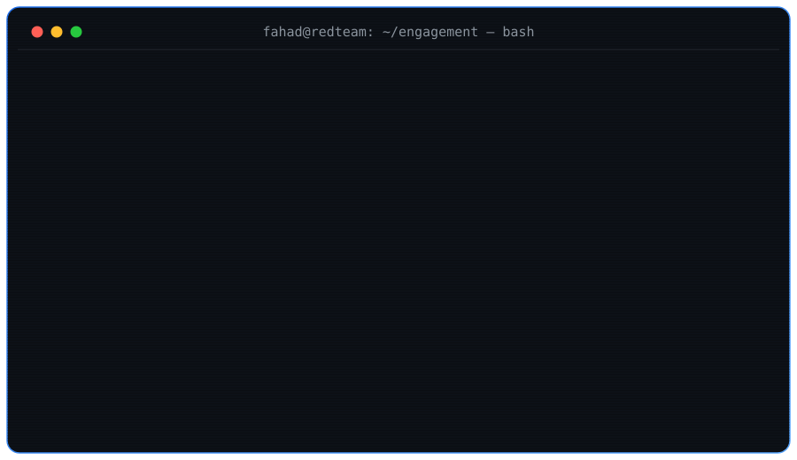

<!-- ========================================================= -->
<!--                  FAHAD YOUSAF  ·  README                  -->
<!--     Penetration Tester · Offensive Security · Exploit     -->
<!-- ========================================================= -->

<div align="center">

<!-- ===== HERO ===== -->


<!-- ===== STATUS BAR ===== -->
<a href="./Fahad_Yousaf_Resume.pdf"></a>
<a href="https://fahadyousaf.vercel.app/"></a>
<a href="mailto:fahadyousaf90@gmail.com"></a>
<a href="https://github.com/fahad90fa"></a>


<br/><br/>

<!-- ===== LIVE TERMINAL TYPING ===== -->


</div>


##  `system.whoami()`

```python
class FahadYousaf:
    """ Penetration Tester · Offensive Security & Exploit Development """

    def __init__(self):
        self.location   = "Lahore, Pakistan"          # UTC+05:00
        self.experience = "3+ years · authorized engagements"
        self.titles     = ["Penetration Tester", "Red Teamer", "Exploit Developer"]
        self.day_job    = ["Web / API Pentest", "Exploit & Tooling R&D", "SOC / Blue Team"]

    def engagement(self) -> dict:
        return {
            "recon":        "OSINT · enumeration · attack-surface mapping",
            "exploit":      "SQLi · XSS · IDOR · SSRF · auth-bypass  →  PoC chains",
            "post_exploit": "privilege escalation · lateral movement · C2",
            "deliver":      "CVSS-scored reports mapped to OWASP Top 10 & MITRE ATT&CK",
        }

    def motto(self) -> str:
        return "Break it to understand it. Build it to defend it."
```


## 📊 `impact --verified`

<div align="center">


<br/>


</div>


## 🧰 `arsenal`

<div align="center">

**— LANGUAGES & DATABASES —**


**— RECON · EXPLOITATION · RED TEAM —**


**— REVERSE ENGINEERING & EXPLOIT DEV —**


**— BLUE TEAM / SOC —**


**— FRAMEWORKS & STANDARDS —**


</div>


## ⚡ `services.run()`

<table align="center">
<tr>
<td align="center" width="25%">🎯<br/><b>Offensive</b><br/><sub>Web / API Pentest<br/>Red Teaming<br/>Vuln Assessment</sub></td>
<td align="center" width="25%">💥<br/><b>Exploit R&D</b><br/><sub>Buffer Overflow / ROP<br/>Shellcode & PoCs<br/>Reverse Engineering</sub></td>
<td align="center" width="25%">🛡️<br/><b>Blue Team / SOC</b><br/><sub>SIEM Rule Tuning<br/>Incident Response<br/>Threat Detection</sub></td>
<td align="center" width="25%">🧱<br/><b>Systems</b><br/><sub>RHEL Hardening (CIS)<br/>Firmware / Bootkit R&D<br/>Security Automation</sub></td>
</tr>
</table>


## 💻 `live_engagement --replay`

<div align="center">

<!-- Custom hand-built animated SVG — loops a full red-team session -->


</div>


## 🧭 `experience --timeline`

### 🎯 Penetration Tester — Freelance &nbsp;·&nbsp; `2022 – Present`
`Remote / Lahore` · US-based clients under NDA
- Chained **SQLi / XSS / IDOR / SSRF / broken-auth** across **15+ production web apps & APIs** into working PoC exploit chains → **100% verified remediation** on retest.
- Built **Python / C / Bash** automation for recon, enumeration & post-exploitation → cut recon-to-exploitation time **−60%**; sustained **4.9/5** client rating with CVSS-scored, developer-ready reports.

### 🔵 SOC Analyst (Level 1) — SK Cyber Technologies &nbsp;·&nbsp; `2023 – 2025`
`Lahore` · 24/7 environment
- Tuned SIEM correlation rules & SOC playbooks → **−35% false positives**, improved MTTD; held **sub-15-min** triage on all P1/P2 alerts.
- Contained **3 active malware intrusions + 2 phishing campaigns** before lateral movement; authored **12 standardized IR runbooks** (−25% L1→L2 handoff time).

### 🟥 Red Hat (RHEL) Operator — CyberSilo &nbsp;·&nbsp; `2020 – 2022`
`Lahore`
- CIS-hardened **30+ RHEL production servers** (SELinux / auditd / firewalld) → eliminated **100% of critical misconfigurations** in a 60-day window.
- Automated patch-cycle & baseline validation in **Bash / Python** → **−40%** fleet-wide remediation time.


## 🔬 `featured.research`

<div align="center">

<a href="https://github.com/fahad90fa/EverCrypt-Bootkit">
  
</a>

</div>

> ### 🧬 EverCrypt-Bootkit &nbsp; `★ 50+`
> Open-source PoC demonstrating **MBR-stage persistence** and **boot-level defense evasion**.
> Cited in 2 security research threads. &nbsp;·&nbsp; `C` · `Assembly` · `x64dbg`
>
> ### 🧱 Custom Perimeter Firewall & WAF-Bypass Research
> Engineered a packet-filtering firewall handling **10k+ daily packets**; published **WAF-bypass** and
> **memory-corruption** research, distilled into a repeatable, engagement-ready testing methodology.


## 📈 `git.stats`

<div align="center">


<br/><br/>


</div>


## 🎓 `education --certs`

- 🎓 **B.S. in Cyber Security** — University of Management & Technology (UMT), Lahore · `2025`
- 📜 **Cyber Security, Levels 1–3 (Grade A)** — Arfa Karim Technology Incubator (IQA, USA) · `2026`


<div align="center">

### 💬 `let's connect`

<a href="./Fahad_Yousaf_Resume.pdf"></a>
<a href="https://fahadyousaf.vercel.app/"></a>
<a href="mailto:fahadyousaf90@gmail.com"></a>
<a href="https://github.com/fahad90fa"></a>

<br/>

*Open to penetration testing, red team & offensive security roles — authorized engagements only.*

</div>

<!-- ===== ANIMATED FOOTER ===== -->

