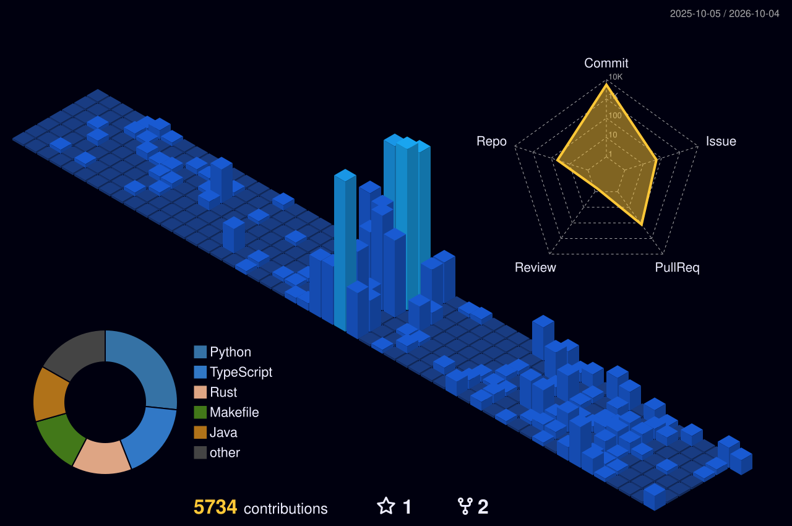

<!-- ========================================================= -->
<!--                  FAHAD YOUSAF  ·  README                  -->
<!--        Zero-config · 100% animated · all SVG/APIs         -->
<!-- ========================================================= -->

<div align="center">

<!-- ===== HERO ===== -->


<!-- ===== STATUS BAR ===== -->
<a href="https://fahadyousaf.vercel.app/"></a>
<a href="mailto:fahadyousaf90@gmail.com"></a>
<a href="https://github.com/fahad90fa"></a>


<br/><br/>

<!-- ===== LIVE TERMINAL TYPING ===== -->


</div>

<!-- ===== NEON DIVIDER ===== -->


##  `system.whoami()`

```python
class FahadYousaf:
    """ Full Stack Developer · Security Researcher """

    def __init__(self):
        self.location   = "Pakistan"  # UTC+05:00
        self.roles      = ["Full Stack Dev", "Offensive Security"]
        self.focus      = ["Web Apps", "Pentesting", "Systems Programming"]
        self.philosophy = "Break it to understand it. Build it to defend it."

    def current_work(self) -> dict:
        return {
            "building":    "Full stack applications & custom security tooling",
            "exploring":   "Cloud-native architecture & systems programming",
            "researching": "Firmware security & vulnerability analysis",
        }

    def say_hi(self) -> str:
        return "Let's build something that doesn't get owned."
```


## 🧰 `arsenal` — full tech stack

<div align="center">

**— LANGUAGES —**


**— FRONTEND —**


**— BACKEND & DATA —**


**— CLOUD · DEVOPS · SECURITY —**


</div>


## ⚡ `services.run()`

<table align="center">
<tr>
<td align="center" width="25%">🌐<br/><b>Web Dev</b><br/><sub>Full Stack Apps<br/>REST / GraphQL APIs<br/>Real-Time Systems</sub></td>
<td align="center" width="25%">🔐<br/><b>Security</b><br/><sub>Penetration Testing<br/>Vuln Assessment<br/>Code Audits</sub></td>
<td align="center" width="25%">☁️<br/><b>Cloud / DevOps</b><br/><sub>CI/CD Pipelines<br/>Container Orchestration<br/>Infra as Code</sub></td>
<td align="center" width="25%">🔧<br/><b>Systems</b><br/><sub>Low-Level Dev<br/>Firmware Analysis<br/>Reverse Engineering</sub></td>
</tr>
</table>


## 📊 `git.stats --all`

<div align="center">


<br/><br/>

<!-- ALL languages: full count, includes private repos -->


</div>


## 🧊 `contribution.calendar --3d`

<div align="center">

<!-- 3D isometric animated render — generated by .github/workflows/profile-3d.yml -->
<!-- Shows a broken-image icon until the Action runs ONCE (Actions tab → Run workflow) -->


</div>


## 🔬 `featured.projects`

<div align="center">

<a href="https://github.com/fahad90fa/uefi-rootkit">
  
</a>

</div>

> ### 🔬 UEFI Rootkit
> Firmware-level persistence framework for **authorized security research**.
> Demonstrates bootkit techniques, SMM hooks, and detection evasion in a controlled lab.
>
> `C` · `EDK2` · `Assembly` · `Python` · `Flask` · `React`


<div align="center">

### 💬 `let's connect`

<a href="https://fahadyousaf.vercel.app/"></a>
<a href="mailto:fahadyousaf90@gmail.com"></a>
<a href="https://github.com/fahad90fa"></a>

<br/>

*Open to collaborations, security research & high-impact opportunities.*

</div>

<!-- ===== ANIMATED FOOTER ===== -->

